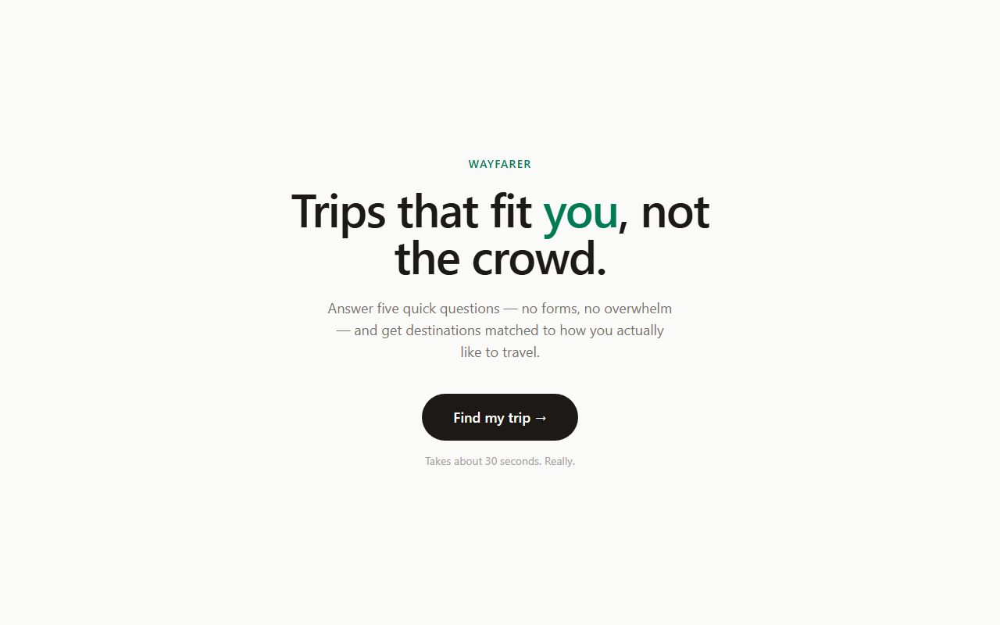
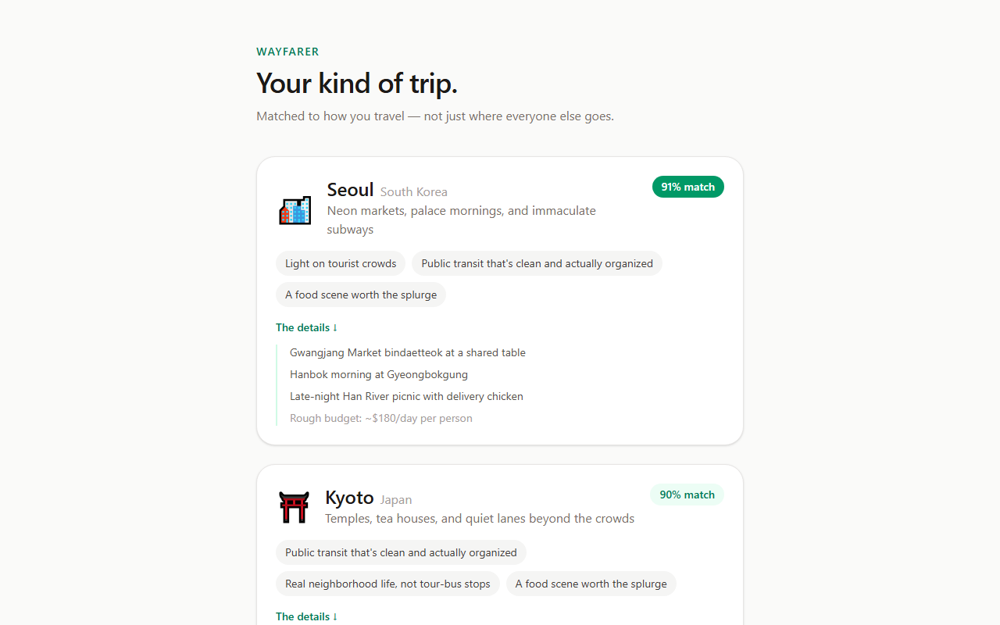

# Wayfarer

[](https://github.com/joshsake/wayfarer/actions/workflows/ci.yml)
[](LICENSE)

A travel-matching app: answer five questions about how you like to travel, get
three destinations scored against your answers — with the reasons why. It also
splits a multi-country trip: give it your dates, countries, and minimum stays,
and it allocates the days into an ordered itinerary — again with the reasons why.

**[▶ Try it live](https://wayfarer-xi.vercel.app)**

Built with Next.js 16 (App Router), Tailwind v4, Supabase, and Playwright.
Every push runs a production build and the Playwright suite in CI.

| Five questions in | Ranked matches out — with the why |
| --- | --- |
|  |  |

## Getting started

```bash
npm install
cp .env.example .env.local   # then fill in your Supabase values
npm run dev
```

Open [http://localhost:3000](http://localhost:3000).

**The env step is not optional.** The app reads its Supabase connection details
from the environment and throws at startup if they're missing — deliberately,
so a misconfiguration fails immediately and obviously instead of rendering an
empty results page. See [.env.example](.env.example) for where each value
lives in the Supabase dashboard.

## How it fits together

```
src/app/plan       the five-question wizard (client component)
src/app/results    scores and renders matches (server component)
src/app/trip       the trip-splitter form (client component)
src/app/trip/results  runs the split and renders the legs (server component)
src/app/api/flights   route handler — proxies Duffel so the token stays server-side
src/components/FlightStrip.tsx  one transition's flight offers (client component)
src/lib/types.ts   the domain types everything else agrees on
src/lib/matching.ts  rank() — pure scoring; recommend() — fetch + rank
src/lib/trip.ts    splitTrip() — pure day-allocation engine, no I/O
src/lib/flights.ts   flightQueries() + normalizeOffers() — pure, no network
src/lib/duffel.ts    server-only Duffel client (static bearer token)
src/lib/destinations.ts  loads the catalog from Supabase, maps rows to types
src/lib/supabase.ts      the shared Supabase client
```

Two design choices worth knowing about:

**Data flows straight into the server component.** `/results` already runs on
the server, so it queries Supabase directly rather than calling an internal API
route. An API route would mean the server making an HTTP request to itself to
reach a database it can already talk to. Route handlers earn their place when a
*browser* or an external caller needs the data — and `/api/flights` is exactly
that exception: the browser fetches flight offers after the page renders, and
the Duffel access token must never leave the server (see
[Flights](#flights-optional) below).

**The scoring algorithm is pure.** `rank(prefs, destinations)` takes the
catalog as an argument and does no I/O, so it can be unit-tested with a handful
of fake destinations. `recommend()` is the thin async wrapper that fetches real
data and delegates. Keeping I/O at the edges is what makes the interesting
logic testable.

## Database

The destination catalog lives in a Supabase Postgres table. Schema and seed
data live in [supabase/migrations/](supabase/migrations/), so the database is
reproducible rather than hand-edited. The first migration is a *retroactive
baseline* — the project started life in the Supabase dashboard, and that file
captures what existed so every later change has a recorded starting point. To
apply them to a fresh project, paste each file into the Supabase SQL editor in
order, or run `supabase db push` if you have the CLI linked to your project.

The `destinations` table has Row Level Security enabled with a
single policy: anyone may `SELECT`, nobody may write through the API. Writes
happen via migrations.

Score columns carry `CHECK (… between 0 and 100)` constraints — the TypeScript
type documents that range in a comment, but only the database can enforce it.

## Flights (optional)

The trip plan can show real flight offers for every transition — home to first
stop, between legs, last stop to home — powered by [Duffel](https://duffel.com)
(API docs at [duffel.com/docs](https://duffel.com/docs)). The feature is
strictly optional: without a token the plan renders exactly the same, and each
flight strip quietly reports that flights are unavailable.

To turn it on, add to `.env.local`:

```bash
DUFFEL_ACCESS_TOKEN=duffel_test_...   # Duffel dashboard → Access tokens
```

The variable does not carry the `NEXT_PUBLIC_` prefix, on purpose: an access
token is a real credential (a live one can book and pay), so it must never
reach the browser bundle. The browser instead calls our own `/api/flights`
route handler, which holds the token server-side, asks Duffel for offers, and
returns the three cheapest.

Three caveats worth knowing:

**The prices are test data.** A `duffel_test_` token puts Duffel in test mode,
which serves synthetic offers — the real shape, not bookable reality. The UI
labels them with a "test data" badge for exactly that reason.

**The endpoint is deliberately unthrottled.** `/api/flights` has no auth and no
rate limiting, a documented decision (see the note in
`src/app/api/flights/route.ts`): it's a personal app behind a test token whose
searches are free, and tripping Duffel's rate limit just degrades the UI to
"unavailable". Point it at a live token — where searches start costing money
past Duffel's search-to-book ratio — and that decision must be revisited first.

**Don't re-add Amadeus.** The feature was originally built on the Amadeus
Self-Service test API, which Amadeus decommissioned on 2026-07-17 — that free
sandbox can no longer be obtained. The provider swap touched only
`src/lib/duffel.ts` and the field mapping in `normalizeOffers`; nothing else in
the feature ever knew which provider it was talking to.

## Tests

Two runners, split by filename suffix so they never steal each other's files:
`*.test.ts` is Vitest, `*.spec.ts` is Playwright.

```bash
npm run test:unit      # Vitest — pure functions, no browser, milliseconds
```

The unit suite hammers the trip-splitting engine — feasibility math, day
allocation, ordering — which is exactly why `splitTrip()` does no I/O: pure
functions can be tested exhaustively without a database or a browser.

```bash
npm run build          # Playwright serves the production build
npx playwright test
```

Ten end-to-end specs cover the wizard flow, the back button, the
no-splurges path, that results are actually personalized, the trip splitter's
happy and infeasible paths, and the flight strips in their offers,
no-flights-found, and unavailable states. The flight specs stub `/api/flights` with `page.route()` —
CI has no Duffel token, and live fares would make assertions flaky. Every
selector is a `data-testid` planted in the components, not a CSS path that
breaks when a class changes.

## Deployment

Vercel builds from the GitHub repo: every pull request gets a preview URL,
every merge to `main` ships to production. GitHub Actions is the quality gate
(build + E2E) and runs independently.

Both `NEXT_PUBLIC_SUPABASE_URL` and `NEXT_PUBLIC_SUPABASE_PUBLISHABLE_KEY` must
be set in **three** places: `.env.local` for local dev, GitHub repository
secrets for CI, and Vercel project environment variables for deploys.
